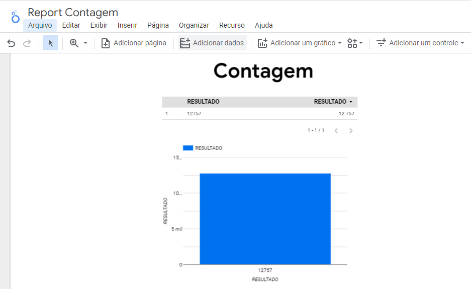
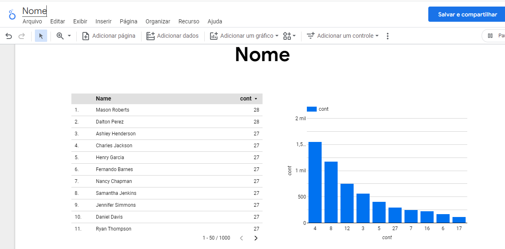
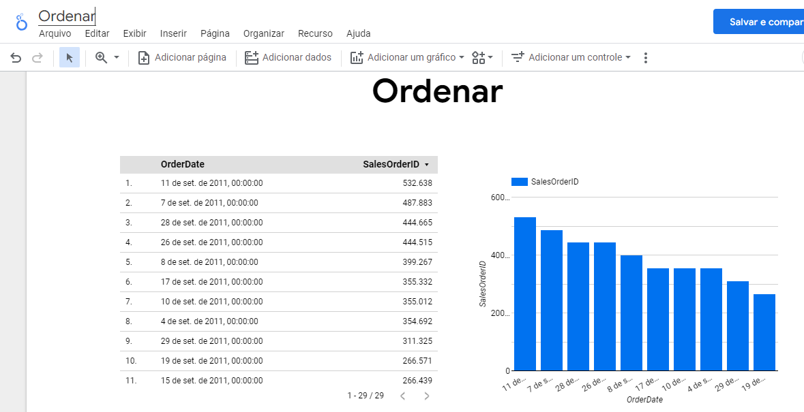

# Case-Rox
  O case em questão se refere aos dados de uma empresa que produz bicicletas.
  O objetivo deste desafio é compreender os seus conhecimentos e experiência analisando os seguintes aspectos:
  1.	Fazer a modelagem conceitual dos dados;
  2.	Criação da infraestrutura necessária;
  3.	Criação de todos os artefatos necessários para carregar os arquivos para o banco criado;
  4.	Desenvolvimento de SCRIPT para análise de dados;
  5.	(opcional) Criar um relatório em qualquer ferramenta de visualização de dados.

## Modelagem conceitual dos dados
Utilizando como base o diagrama que foi disponibilizado no arquivo, a modelagem de dados foi realizada utilizando a ferramente Gen My Model:


  ## Criação da infraestrutura necessária
Para a criação da infraestrutura, optei pelo GCP, por sem uma plataforma que tenho alguma familiaridade e por ser possível utiliza-lo gratuitamente dentro de um período de tempo.

  ### Carga dos arquivos
  Para poder acessar os arquivos csv's pelo BigQuery, realizei o upload dos mesmo através do Google Storage


  ### Criação de tabelas
  Já com os arquivos no Storage, utilizando o BigQuery criei dois data set's, um para as tabelas brutas e outro para tabelas refinadas


Com os data set's criados, criei as tabelas brutas utilizandos os arquivos csv que estavam no Storage


## Desenvolvimento de SCRIPT para análise de dados
Após a criação das tabelas, foram criados os scripts conforme o que o case solicitava

  #### 1.	Escreva uma query que retorna a quantidade de linhas na tabela Sales.SalesOrderDetail pelo campo SalesOrderID, desde que tenham pelo menos três linhas de detalhes
  Script

   ```sql
CREATE OR REPLACE TABLE `intense-acrobat-394414.refinadas_rox.Contagem` AS (

WITH CONTAGEM AS (
  SELECT 
    COUNT(*) as cont,
    SalesOrderID
FROM 
    `intense-acrobat-394414.brutas_rox.SalesOrderDetail`
GROUP BY 
    SalesOrderID
HAVING 
    COUNT(*)>=3
) SELECT COUNT(1) AS RESULTADO FROM CONTAGEM
)
 ```
Resultado apresentado utilizando o Looker Studio



  #### 2.	Escreva uma query que ligue as tabelas Sales.SalesOrderDetail, Sales.SpecialOfferProduct e Production.Product e retorne os 3 produtos (Name) mais vendidos (pela soma de OrderQty), agrupados pelo número de dias para manufatura (DaysToManufacture).
  Script

   ```sql
CREATE OR REPLACE TABLE `intense-acrobat-394414.refinadas_rox.MaisVendido` AS (


SELECT Product.Name, SUM(OrderQty) AS Soma_OrderQty, DaysToManufacture
FROM 
    `intense-acrobat-394414.brutas_rox.SalesOrderDetail` AS salesorderdetail, 
    `intense-acrobat-394414.brutas_rox.SpecialOfferProduct` AS specialofferproduct,
    `intense-acrobat-394414.brutas_rox.Product` AS Product
WHERE 
    Product.ProductID=specialofferproduct.ProductID
AND 
    specialofferproduct.SpecialOfferID=salesorderdetail.SpecialOfferID
AND 
    specialofferproduct.ProductID=salesorderdetail.ProductID
GROUP BY 
    DaysToManufacture,Product.Name
ORDER BY 
    SUM(OrderQty) DESC
    LIMIT 3

)
```

Resultado apresentado utilizando o Looker Studio


  #### 3.	Escreva uma query ligando as tabelas Person.Person, Sales.Customer e Sales.SalesOrderHeader de forma a obter uma lista de nomes de clientes e uma contagem de pedidos efetuados.
  Script

   ```sql
CREATE OR REPLACE TABLE `intense-acrobat-394414.refinadas_rox.Nome` AS (


SELECT concat(FirstName,' ', LastName) as Name, COUNT(SalesOrderID) as cont
FROM  `intense-acrobat-394414.brutas_rox.Person` AS Person, 
      `intense-acrobat-394414.brutas_rox.Sales_Customer` AS Customer, 
      `intense-acrobat-394414.brutas_rox.SalesOrderHeader` AS Salesorderheader
WHERE 
      CAST(Person.BusinessEntityID AS STRING)=Customer.PersonID
AND customer.CustomerID=Salesorderheader.CustomerID
GROUP BY FirstName, LastName

)
```


Resultado apresentado utilizando o Looker Studio



 #### 4.	Escreva uma query usando as tabelas Sales.SalesOrderHeader, Sales.SalesOrderDetail e Production.Product, de forma a obter a soma total de produtos (OrderQty) por ProductID e OrderDate.
  Script

   ```sql
CREATE OR REPLACE TABLE `intense-acrobat-394414.refinadas_rox.SomaProdutos` AS (


SELECT SUM(OrderQty) AS Soma_OrderQty, Name, Product.ProductID, OrderDate
FROM 
  `intense-acrobat-394414.brutas_rox.SalesOrderDetail` AS salesorderdetail, 
  `intense-acrobat-394414.brutas_rox.SalesOrderHeader` AS salesorderheader, 
  `intense-acrobat-394414.brutas_rox.Product` AS product
WHERE 
  product.ProductID=salesorderdetail.ProductID
AND 
  salesorderdetail.SalesOrderID=salesorderheader.SalesOrderID
GROUP BY  ProductID, OrderDate, Name
ORDER BY SUM(OrderQty) DESC

)
```

Resultado apresentado utilizando o Looker Studio


  #### 5.	Escreva uma query mostrando os campos SalesOrderID, OrderDate e TotalDue da tabela Sales.SalesOrderHeader. Obtenha apenas as linhas onde a ordem tenha sido feita durante o mês de setembro/2011 e o total devido esteja acima de 1.000. Ordene pelo total devido decrescente.
  Script
  
   ```sql
CREATE OR REPLACE TABLE `intense-acrobat-394414.refinadas_rox.Ordenar` AS (

SELECT 
  SalesOrderID, 
  OrderDate, 
  TotalDue
FROM 
  `intense-acrobat-394414.brutas_rox.SalesOrderHeader` AS salesorderheader
WHERE 
  OrderDate BETWEEN '2011-09-01' AND '2011-09-30'
AND TotalDue>1000
ORDER BY TotalDue DESC

)
```


Resultado apresentado utilizando o Looker Studio




### Criação de tabelas refinadas
  A partir da execução de cada script, foram criadas tabelas com os respectivos resultados no data set de tabelas refinadas

## Ferramentas utilizadas
  #### Gen My Model
  #### Google Cloud
  
  Cloud Storage
  
  BigQuery
  
  Looker Studio
  #### GitHub


    
